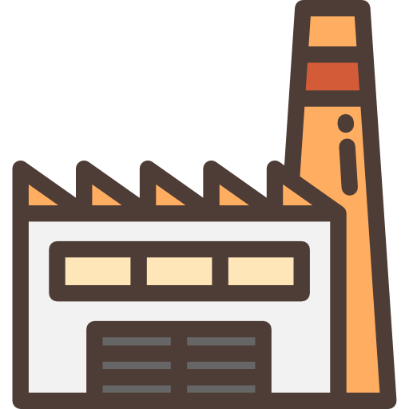

# Завод

  

Здесь документация по работе в технической коменде Punklab Завода.

Тут вы найдете информацию о том как сопровождать проекты, обязательные требования к ведению проекта, рекомендации и советы. Документация будет расширяться и о важных обновлениях будет сообщаться.

/// info | Информация
Любой желающий из нашей команды может внести изменения через PR или написать issue в репозитории.
///
